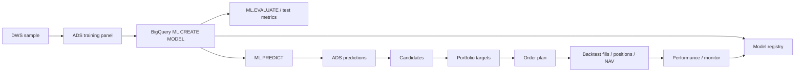

> Retired / historical（2026-06-10，GPT-5 Codex）：本文记录历史 BQML / SQL runner 方案；BQML-only `02-04` 与 SQL ledger fallback `08` 已退役删除，不再作为当前 Strategy1 默认、fallback、诊断或新增开发入口。当前 active path 为 Cloud Run Python training / prediction / ledger + 共享 BigQuery SQL candidate / portfolio / order / report / QA + v3 acceptance gate。

# 策略 1 `ml_pv_clf_v0` Runner 设计

> 文档维护：GPT-5（最近更新 2026-06-01）
> 状态：草案 v0.1，等待 owner review。
> 范围：只覆盖策略 1 的 BigQuery ML runner 方案。训练、预测、候选池、组合和回测均在 BigQuery 内用 SQL / BigQuery ML 编排，不设计 BigQuery 之外的训练 runner。

---

## 1. 设计目标

本 runner 是策略 1 从已物化 DWS 到 ADS 闭环的执行层，负责把 `ml_pv_clf_v0` 的一次实验或一次日常预测固化为可复现的 `run_id`。

核心目标：

1. **数据不搬出 BigQuery**：训练样本、模型对象、预测、组合、回测结果均留在 `data-aquarium`。
2. **SQL 可复现**：每次运行由参数、SQL 脚本、BigQuery ML model object 和 ADS 结果表共同复现。
3. **PIT 不退化**：只使用 `trade_date=t` 时已知的 DWS 字段；候选池生成阶段不得使用 `t+1` 实际成交字段。
4. **先基线后复杂化**：首版用 BigQuery ML `LOGISTIC_REG` 训练 `label_top30_5d`，必要时加 `LINEAR_REG` 对照；树模型留到基线稳定后。

非目标：

- 不实现 BigQuery 之外的模型训练、特征预处理或模型文件管理。
- 不引入分钟级、盘中、财务、资金流、行业中性化等策略 1 之外特征。
- 不替代已物化的 DWS/ADS 表契约；runner 只负责写入这些 ADS 表。

## 2. 上下游与产物

### 2.1 输入

| 输入 | 说明 |
|---|---|
| `ashare_dws.dws_stock_sample_daily` | 策略 1 样本入口，含默认 universe、价格/估值特征、标签、默认 split。 |
| `ashare_dws.dws_stock_universe_daily` | 预测日 / 调仓日的可交易池与过滤字段。 |
| `ashare_dwd.dwd_stock_eod_price` | 回测撮合、开盘成交、持仓估值。 |
| `ashare_dim.dim_trade_calendar` | 交易日序列、周频调仓日、t+1/t+5 定位。 |
| `ashare_dim.dim_index` | 基准指数 canonical 映射、端点可用性和 benchmark 候选校验。 |
| `ashare_dwd.dwd_index_eod` | 基准指数收益，使用 canonical `sec_code`。 |

### 2.2 输出

| 输出 | 写入方式 |
|---|---|
| `ashare_ads.ads_ml_training_panel_daily` | 每个 `run_id` 冻结训练 / 验证 / 测试 / 预测输入面板。 |
| BigQuery ML model object | 建议落在 `data-aquarium.ashare_ads`，对象名含 `model_id_safe`。 |
| `ashare_ads.ads_model_registry` | 登记 BigQuery model URI、参数、窗口、指标和状态。 |
| `ashare_ads.ads_model_prediction_daily` | 每日 `score`、`rank_raw`、`rank_pct`。 |
| `ashare_ads.ads_stock_candidate_daily` | 调仓日候选池与过滤原因。 |
| `ashare_ads.ads_portfolio_target_daily` | 目标组合权重。 |
| `ashare_ads.ads_order_plan_daily` | 回测订单计划。 |
| `ashare_ads.ads_backtest_*` | 成交、持仓、NAV、绩效汇总。 |
| `ashare_ads.ads_signal_monitor_daily` | 样本数、预测数、分数分布、不可成交归因。 |

### 2.3 模型命名

`model_id` 面向业务追踪，建议：

```text
ml_pv_clf_v0_bqml_logit_YYYYMMDD_NN
```

BigQuery model object 名必须使用 BigQuery 合法标识符，建议与 `model_id` 保持一致并只用字母、数字、下划线：

```text
`data-aquarium.ashare_ads.ml_pv_clf_v0_bqml_logit_20260601_01`
```

`ads_model_registry.model_uri` 写：

```text
bq://data-aquarium.ashare_ads.ml_pv_clf_v0_bqml_logit_20260601_01
```

## 3. Runner 分层

建议后续 SQL 放在：

```text
sql/ml/strategy1/
  00_run_config.sql
  01_build_training_panel.sql
  02_train_bqml_logistic.sql
  03_evaluate_model.sql
  04_predict_daily.sql
  05_build_candidates.sql
  06_build_portfolio_targets.sql
  07_build_order_plan.sql
  08_run_backtest.sql
  09_build_metrics_and_monitor.sql
  10_qa_runner_outputs.sql
```

执行流：



## 4. 运行参数

Runner 以 BigQuery script variables 传参，首版参数如下：

| 参数 | 示例 | 说明 |
|---|---|---|
| `run_id` | `s1_bqml_20260601_01` | 一次运行唯一 id。 |
| `strategy_id` | `ml_pv_clf_v0` | 策略 id。 |
| `model_id` | `ml_pv_clf_v0_bqml_logit_20260601_01` | 模型 id。 |
| `feature_version` | `strategy1_pv_v0_20260601` | DWS 特征版本。 |
| `label_version` | `open_to_close_h1_5_10_20_v20260601` | 标签版本。 |
| `universe_version` | `strategy1_default_v20260601` | 股票池规则版本。 |
| `horizon` | `5` | 主标签 horizon。 |
| `train_start_date` / `train_end_date` | `2019-04-03` / `2023-12-31` | 训练窗口；起点需避开不完整 60 日历史。 |
| `valid_start_date` / `valid_end_date` | `2024-01-01` / `2024-12-31` | 验证窗口。 |
| `test_start_date` / `test_end_date` | `2025-01-01` / `2025-12-31` | 测试窗口。 |
| `predict_start_date` / `predict_end_date` | `2026-01-01` / `CURRENT_DATE` | 预测窗口。 |
| `rebalance_frequency` | `WEEKLY_LAST_OPEN_DAY` | 周频，每周最后一个开市日。 |
| `board_allowlist` | `['SSE_MAIN','SZSE_MAIN']` | 首个基线股票池仅沪深主板，不含北交所、创业板、科创板。 |
| `target_holdings` | 待 owner 确认 | 目标持股数。 |
| `max_single_weight` | 待 owner 确认 | 单票权重上限。 |
| `cost_profile_id` | `cn_a_share_wanyi_no_min_slip5_v20260602` | OQ-010 成本子项已定：佣金万一免五、卖出印花税 5 bps、买/卖滑点各 5 bps；实现见 `PRD_20260602_02_OQ010交易成本口径.md`。 |
| `benchmark_sec_code` | `000852.SH` 示例 | 基准指数 canonical `sec_code`；执行前必须通过 `dim_index` 可用性和完整 NAV 窗口覆盖校验。 |

`OQ-010` 的成本子项已由 `docs/prd/PRD_20260602_02_OQ010交易成本口径.md` 固化并在 runner SQL 中实现；仍需 owner 确认调仓频率、持股数、权重上限等参数。训练工具链已收敛为 BigQuery ML，首个基线板块纳入口径已定为仅沪深主板。

## 5. 训练面板

### 5.1 时间切分

首版不使用随机切分。BigQuery ML 内部 split 关闭，由 runner 显式生成 train / valid / test / live：

| split | 日期 |
|---|---|
| train | `2019-04-03` 至 `2023-12-31` |
| valid | `2024-01-01` 至 `2024-12-31` |
| test | `2025-01-01` 至 `2025-12-31` |
| live | `2026-01-01` 起 |

说明：

- 当前默认可训练样本最早日期是 `2019-04-03`；2019Q1 因 60 日历史不完整被默认掩码剔除。
- 5 日标签会重叠，指标解释时必须按周频调仓或按日期聚合，避免把重叠样本当成独立日频观测。
- 若未来做滚动训练，每个 fold 使用独立 `run_id` 或在 `split_fold` 中记录 fold，不能覆盖旧结果。

### 5.2 模型特征白名单

首版模型特征来自 `dws_stock_sample_daily` 的价格、量价、估值、市值和上市天数字段：

```text
list_age_td,
ret_1d, ret_3d, ret_5d, ret_10d, ret_20d, ret_60d,
mom_20_5, mom_60_20,
vol_5d, vol_20d, vol_60d,
drawdown_20d, hl_range_20d,
amount_ma20_cny, amount_zscore_20d,
turnover_rate, turnover_rate_free_float, turnover_rate_ma20, volume_ratio,
pe_ttm, pb, ps_ttm, dividend_yield_ttm, ep_ttm, bp, sp_ttm,
log_total_mv, log_circ_mv
```

`board` 不进入 v0 主模型。当前默认 universe 下 `board` 仅为 `SSE_MAIN` / `SZSE_MAIN` 二值暴露，信号量低；runner 只把它保留在训练面板、候选池和报告中，用于分组监控、暴露归因和后续板块纳入对照实验。

首版禁止进入模型的字段：

```text
sec_code, trade_date, created_at,
feature_version, label_version, universe_version,
split_tag, split_fold,
sample_trainable_default,
label_entry_tradable, label_valid_*, exit_reachable_*,
fwd_*, rank_pct_*, label_*,
*_qfq,
任何 t+1 或未来实际成交字段
```

### 5.3 预处理口径

BigQuery ML 会处理常见数值缺失和类别编码，但 runner 仍应在 SQL 中显式固化以下口径：

1. `board` 保留为分组 / 暴露字段，不进入 v0 主模型训练列。
2. 数值字段保留原列，并为核心缺失字段增加 `is_null_<feature>` 标记。
3. 极端值处理优先做训练窗口内分位数截尾：分位点只用 train split 计算，再应用到 valid/test/live，不能用全样本分布。
4. `pe_ttm <= 0` 等经济含义特殊值不直接 log；使用现有 `ep_ttm` / `bp` / `sp_ttm` 与缺失标记。
5. `ads_ml_training_panel_daily.feature_values_json` 可保留本次特征快照；BigQuery ML 训练 SQL 仍使用展开后的列，避免 JSON 训练。

## 6. BigQuery ML 训练

首版主模型为二分类：

- `MODEL_TYPE='LOGISTIC_REG'`
- 标签：`label_top30_5d`
- 训练样本：`sample_trainable_default=TRUE AND split_tag='train'`
- 验证/测试：用 `ML.EVALUATE` 分别在 valid/test query 上执行

### 6.1 正则化与调参

BigQuery ML `LOGISTIC_REG` 使用 `L1_REG` 和 `L2_REG` 两个独立正则化参数；不使用 sklearn 的 `l1_ratio`、`C` 或 `alpha` 参数化。因此 runner 不做 `l1_ratio -> L1/L2` 的机械映射，直接以 BQML 原生参数定义候选模型。

首版调参流程：

1. 定义一张候选参数表，至少包含 `candidate_id`、`l1_reg`、`l2_reg`、`model_id`、`run_id`。
2. 对每个候选参数组合创建独立 BigQuery ML model object，`model_id` 中带候选后缀，避免覆盖。
3. 在 valid 窗口对每个候选模型执行 `ML.PREDICT`，写临时或候选态预测结果。
4. 用 SQL 计算 valid RankIC、分层收益、TopN 收益、AUC、log_loss 和样本覆盖率。
5. 以 `valid_rank_ic_mean` 为主选择准则；若接近持平，用分层单调性、TopN 收益稳定性和 log_loss 作为 tie-breaker。
6. 只有胜出的候选模型进入正式 `ads_model_prediction_daily` / 组合 / 回测流程；其余候选在 `ads_model_registry.status` 标为 `candidate_rejected`。

候选网格建议从小规模开始，避免一次性创建过多模型对象：

| candidate_id | `L1_REG` | `L2_REG` | 用途 |
|---|---:|---:|---|
| `l1_0_l2_0` | 0 | 0 | 无正则基线。 |
| `l1_0_l2_1e_4` | 0 | 0.0001 | 轻 L2。 |
| `l1_0_l2_1e_3` | 0 | 0.001 | 中 L2。 |
| `l1_1e_5_l2_1e_4` | 0.00001 | 0.0001 | 轻 L1 + 轻 L2。 |
| `l1_1e_4_l2_1e_3` | 0.0001 | 0.001 | 中 L1 + 中 L2。 |

BigQuery ML 内置 hyperparameter tuning 可以作为辅助诊断，例如用 `HPARAM_CANDIDATES` / `HPARAM_RANGE` 和 `HPARAM_TUNING_OBJECTIVES=['ROC_AUC']` 先观察 AUC/log_loss 方向；但它不作为首版最终选型机制，因为策略验收主目标是 RankIC/分层收益，而不是分类阈值指标。

### 6.2 训练 SQL 模板

训练 SQL 形态：

```sql
CREATE OR REPLACE MODEL `data-aquarium.ashare_ads.ml_pv_clf_v0_bqml_logit_20260601_01`
OPTIONS (
  MODEL_TYPE = 'LOGISTIC_REG',
  INPUT_LABEL_COLS = ['target_label'],
  DATA_SPLIT_METHOD = 'NO_SPLIT',
  AUTO_CLASS_WEIGHTS = TRUE,
  L1_REG = 0.0,
  L2_REG = 0.001,
  MAX_ITERATIONS = 50
) AS
SELECT
  target_label,
  list_age_td,
  ret_1d, ret_3d, ret_5d, ret_10d, ret_20d, ret_60d,
  mom_20_5, mom_60_20,
  vol_5d, vol_20d, vol_60d,
  drawdown_20d, hl_range_20d,
  amount_ma20_cny, amount_zscore_20d,
  turnover_rate, turnover_rate_free_float, turnover_rate_ma20, volume_ratio,
  pe_ttm, pb, ps_ttm, dividend_yield_ttm, ep_ttm, bp, sp_ttm,
  log_total_mv, log_circ_mv
FROM `data-aquarium.ashare_ads.ads_ml_training_panel_daily`
WHERE run_id = @run_id
  AND split_tag = 'train'
  AND trade_date BETWEEN @train_start_date AND @train_end_date;
```

对照模型可用 `LINEAR_REG` 训练 `target_return=fwd_xs_ret_5d`，输出按预测超额收益排序。对照模型写独立 `model_id`，不覆盖分类模型结果。

## 7. 评估与登记

每次训练后必须写 `ads_model_registry`：

| 字段 | 要求 |
|---|---|
| `model_family` | `bqml_logistic_reg` 或 `bqml_linear_reg`。 |
| `model_params_json` | 记录 BQML options、feature list、运行参数。 |
| `metrics_json` | 至少包含 valid/test AUC、log_loss、precision/recall、TopN 平均标签、RankIC、分层收益。 |
| `model_uri` | `bq://project.dataset.model`。 |
| `status` | 新模型默认 `registered`；人工确认后再改 `active`。 |

`ML.EVALUATE` 只覆盖模型统计指标；量化指标需要 runner 另写 SQL：

- 日频 / 周频 RankIC。
- 分 5/10 层的未来收益。
- TopN 未来收益与不可成交归因。
- 按年份的指标分布。

## 8. 预测与打分

预测用 `ML.PREDICT`：

```sql
SELECT
  @model_id AS model_id,
  trade_date AS predict_date,
  @horizon AS horizon,
  sec_code,
  predicted_target_label_probs,
  CURRENT_TIMESTAMP() AS created_at
FROM ML.PREDICT(
  MODEL `data-aquarium.ashare_ads.ml_pv_clf_v0_bqml_logit_20260601_01`,
  (
    SELECT
      trade_date,
      sec_code,
      list_age_td,
      ret_1d, ret_3d, ret_5d, ret_10d, ret_20d, ret_60d,
      mom_20_5, mom_60_20,
      vol_5d, vol_20d, vol_60d,
      drawdown_20d, hl_range_20d,
      amount_ma20_cny, amount_zscore_20d,
      turnover_rate, turnover_rate_free_float, turnover_rate_ma20, volume_ratio,
      pe_ttm, pb, ps_ttm, dividend_yield_ttm, ep_ttm, bp, sp_ttm,
      log_total_mv, log_circ_mv
    FROM `data-aquarium.ashare_ads.ads_ml_training_panel_daily`
    WHERE run_id = @run_id
      AND split_tag IN ('valid', 'test', 'live')
      AND trade_date BETWEEN @predict_start_date AND @predict_end_date
  )
);
```

落 `ads_model_prediction_daily` 前需要把 BigQuery ML 输出标准化成：

```text
score = 正类预测概率
rank_raw = ROW_NUMBER() OVER (PARTITION BY predict_date ORDER BY score DESC, sec_code)
rank_pct = 1 - SAFE_DIVIDE(rank_raw - 1, prediction_count - 1)
```

若 BigQuery ML 输出的概率数组结构随模型类型不同而变化，`04_predict_daily.sql` 必须在脚本内统一抽取正类概率，不能让下游解析模型原生结构。

## 9. 候选池、组合与订单

### 9.1 调仓日

调仓日是每周最后一个开市日：

```text
rebalance_date = 每个 ISO 周内 max(cal_date) where is_open = TRUE
```

### 9.2 候选池

候选池只使用 `rebalance_date=t` 当日已知字段：

- `ads_model_prediction_daily.score`
- `dws_stock_universe_daily.in_universe_default`
- `board` / `market` / `is_st` / `amount_ma20_cny` 等 t 日过滤字段

不得用 `t+1` 的 `can_buy_open` 或 `label_entry_tradable` 预先过滤候选。

### 9.3 组合目标

首版默认组合规则：

1. 按 `score DESC` 选择前 `target_holdings`。
2. 等权，单票权重不超过 `max_single_weight`。
3. 不能在 `t+1` 不可买时临时替补低排名股票，除非后续 owner 明确开启候补规则。
4. 目标权重、目标金额、目标股数写 `ads_portfolio_target_daily`。

### 9.4 订单计划

`ads_order_plan_daily` 由目标组合与上一期持仓 diff 生成：

- 新增或增持：`BUY`
- 降权或清仓：`SELL`
- `expected_price` 使用 `t` 日收盘价或 `t+1` 开盘价估算需明确标记；实际回测成交以撮合层为准。

## 10. BigQuery SQL 回测

回测仍在 BigQuery 内完成，按日生成成交、持仓、NAV 和绩效。

撮合规则：

1. 信号日 `t`，订单在 `t+1` 开盘尝试成交。
2. 买入要求 `can_buy_open[t+1]=TRUE`；否则本期跳过、记 `BUY_SKIPPED_UNTRADABLE` 意图行并保留现金。
3. 卖出要求 `can_sell_open[t+1]=TRUE`；否则本期跳过、记 `SELL_SKIPPED_UNTRADABLE` 意图行，持仓 carry 到下一个调仓执行日再试（v1 ledger：不做 daily next-sellable 顺延搜索）。
4. 成本包括佣金、印花税、滑点；OQ-010 默认成本 profile 为 `cn_a_share_wanyi_no_min_slip5_v20260602`，已由分项成本参数实现（`commission_bps`、`stamp_tax_buy/sell_bps`、`slippage_buy/sell_bps`），替代单一 `cost_bps`。
5. 持仓估值使用日收盘价；停牌日沿用可用收盘价并标记。

输出指标：

- NAV、日收益、最大回撤、年化收益、年化波动、Sharpe。
- 基准超额收益与信息比率。
- 年化换手、成本敏感性。
- 买入/卖出不可交易跳过率（`buy_skip_rate` / `sell_skip_rate`，从 `ads_backtest_trade_daily` 的 `*_SKIPPED_UNTRADABLE` 行汇总）。

## 11. 回测报告落点

回测结果分两类存储：

1. **机器可消费结果**：以 BigQuery ADS 表为事实来源。
   - 成交：`ashare_ads.ads_backtest_trade_daily`
   - 持仓：`ashare_ads.ads_backtest_position_daily`
   - 净值：`ashare_ads.ads_backtest_nav_daily`
   - 汇总绩效：`ashare_ads.ads_backtest_performance_summary`
   - 模型与运行元数据：`ashare_ads.ads_model_registry`
   - 信号监控：`ashare_ads.ads_signal_monitor_daily`
2. **人读报告文件**：runner 在完成指标汇总后生成 Markdown / HTML 报告和图表，先上传到 GCS 作为持久 artifact，再在本地仓库下保留一份同结构镜像，方便用户直接打开查看。

```text
gs://<ashare-artifact-bucket>/reports/strategy1/ml_pv_clf_v0/run_id=<run_id>/backtest_id=<backtest_id>/
  report.md
  report.html
  metrics.json
  assets/
    nav.png
    drawdown.png
    ic_by_year.png
    layer_return.png
```

本地镜像路径：

```text
reports/strategy1/ml_pv_clf_v0/run_id=<run_id>/backtest_id=<backtest_id>/
  report.md
  report.html
  metrics.json
  assets/
    nav.png
    drawdown.png
    ic_by_year.png
    layer_return.png
```

`<ashare-artifact-bucket>` 是待配置的 GCS bucket，不写死在 SQL 中；runner 参数使用 `artifact_base_uri` 注入。建议同项目、同区域或同合规域管理，并通过 IAM 控制读写权限。

本地 `reports/` 是用户读取镜像，不作为事实来源，默认不提交 git。Runner 对同一 `run_id/backtest_id` 重跑时应覆盖同目录，或在 `force_replace=FALSE` 时拒绝覆盖。

报告文件不是事实来源，只是 ADS 结果的快照摘要。Runner 把报告状态写回 `ads_backtest_performance_summary.metrics_json`，模式感知（PR #12 起）：

- `local_report_path`、`report_upload_status`（`uploaded` / `skipped`）始终写入。
- `report_uri`（`gs://…`）**仅在真实上传 GCS 成功时**写入；`--skip-gcs-upload`（local-only）模式不写 `report_uri`，避免指向不存在的对象。
- `10_qa_runner_outputs.sql` 做模式感知断言：`report_upload_status` + `local_report_path` 必填，`report_uri` 当且仅当 `uploaded` 时存在。

若后续报告运行增多，再新增轻量表 `ads_backtest_report_registry`，以 `(backtest_id, run_id)` 记录 `report_uri`、artifact 清单、生成时间和报告版本。

首版报告至少包含：

- run 配置：`run_id`、`model_id`、`backtest_id`、训练/验证/测试/预测窗口、成本参数、持股数、权重上限。
- 模型指标：AUC、log loss、TopN 命中率、RankIC、分层收益。
- 组合指标：NAV、年化收益、最大回撤、Sharpe、IR、换手、成本敏感性。
- 可交易性归因（v1 ledger）：买入/卖出不可交易跳过率（`buy_skip_rate` / `sell_skip_rate`），从 `ads_backtest_trade_daily` 的 `*_SKIPPED_UNTRADABLE` 意图行汇总。
- BigQuery 来源表和查询窗口，确保报告可追溯到 ADS。

## 12. 幂等与安全

### 12.1 `run_id` 幂等

每个脚本开始前检查目标 ADS 表是否已有相同 `run_id`：

- 默认行为：发现已有 `run_id` 则失败。
- `force_replace=TRUE` 时：先按 `run_id` 删除相关 ADS 行，再重写。
- BigQuery model object 不静默覆盖 active 模型；如需覆盖，只允许覆盖同 `run_id` 的临时模型。

### 12.2 分区与成本

所有大表读写必须带日期范围过滤：

- DWS：`trade_date BETWEEN ...`
- ADS 预测/组合：`predict_date` / `rebalance_date`
- 回测：`trade_date`

上线前执行 dry-run，记录 bytes processed。禁止 `SELECT *` 进入训练 SQL，特征列必须显式枚举。

### 12.3 权限

执行身份需要：

- 读取 `ashare_dim`、`ashare_dwd`、`ashare_dws`。
- 写入 `ashare_ads` 表。
- 在 `ashare_ads` 创建 / 替换 BigQuery ML model。

仓库、脚本、日志不得记录任何凭据。

## 13. QA

`10_qa_runner_outputs.sql` 至少覆盖：

| 检查 | 目的 |
|---|---|
| `ads_ml_training_panel_daily` 同一 `run_id, sec_code, trade_date` 唯一 | 防重复样本。 |
| train/valid/test/live 日期互斥且有序 | 防时间穿越。 |
| 特征列不含 `fwd_*`、`label_*`、`rank_pct_*`、`*_qfq` | 防标签泄露和前复权泄露。 |
| 训练面板行数等于 DWS 默认可训练样本预期 | 防 join 意外丢样本。 |
| 每个预测日 `prediction_count` 与可预测样本数一致 | 防预测漏股。 |
| 每个预测日 `rank_raw=1` 唯一，`rank_pct` 在 `[0,1]` | 防排序异常。 |
| 每个调仓日目标权重和 `<= 1.0`，单票 `<= max_single_weight` | 防组合越界。 |
| 候选池生成 SQL 未引用 `t+1` 可交易字段 | 防事后过滤。 |
| NAV 日期连续覆盖开市日，无负现金异常 | 防回测断裂。 |
| registry 中每个 active model 有唯一 `model_uri` | 防模型指针混乱。 |

## 14. 验收标准

首个可验收 run 需要满足：

1. 一个 `run_id` 从训练面板开始，完整写入 registry、prediction、candidate、portfolio、order、backtest、monitor。
2. BigQuery 中存在对应 model object，`ads_model_registry.model_uri` 可定位。
3. QA 脚本通过。
4. 输出 valid/test 的模型指标和量化指标：AUC、log_loss、RankIC、分层收益、TopN 收益、NAV、换手、不可成交比例。
5. 所有训练和回测数据留在 BigQuery 内。

## 14.1 回测引擎口径（v1 = 账户级有状态 ledger）

**定性**：`08_run_backtest.sql` 自 PR #12 为**账户级有状态 ledger**（BigQuery scripting `WHILE` 循环逐调仓 period）。原 v0 set-based episode 模型在真机实跑时违反守卫（仓位名义按 `initial_capital × weight` 固定额、不回收资金 → 累计买入远超本金、现金为负、gross 远超 1），按 DECISION-20260601-07 的升级触发硬规则已重写为 ledger（DECISION-20260602-01）。

**v1 ledger 口径**：
- 每个 `t+1 exec_date` 先按当前持仓估值得 NAV（停牌无价用最近可用收盘前向填充）。
- 目标仓位 = 目标权重 × **当前 NAV**（资金复利/回收，非固定初始资金额）。
- **卖出先于买入**；买入受**可用现金约束**（总买入含成本超现金则等比缩放），保证现金不为负、gross ≤ 1。
- 对**实际持仓 netting**（滚动持有的票不重复全卖全买）。
- 不可交易腿（不可买/卖或无开盘价）本期跳过、记 `BUY_SKIPPED_UNTRADABLE` / `SELL_SKIPPED_UNTRADABLE` 意图行（`filled_shares=0`），持仓 carry 到下一个调仓执行日再尝试。
- 循环后按交易日展开每日持仓/NAV。

**v1 简化（已文档化）**：不可交易腿只在调仓执行日重试，**不做 60 交易日 daily next-sellable 顺延搜索，无 `SELL_BLOCKED_NO_NEXT_SELLABLE_60D`**；未复权口径、持有期除权简化。后续若需更高保真（部分成交、日内撮合、复权持有、卖出顺延搜索）可在此 ledger 基础上扩展。

**守卫**：`10_qa_runner_outputs.sql` 断言 `cash_cny >= -1`、`gross_exposure <= 1.005`、持仓按 `(trade_date, sec_code)` 唯一、NAV 覆盖 predict 窗口每个开市日；这些不变量由 ledger 构造保证，并经端到端实跑验证（16 断言全过）。

**09 成交诊断**：从 `ads_backtest_trade_daily` 的 FILLED / `*_SKIPPED_UNTRADABLE` 行 1:1 汇总 buy/sell 的 attempt/filled/skipped 计数与 skip rate，与成交表可对账（不再用旧 episode/next-sellable 口径重算）。

背景见 `.agent/memory/DECISION_LOG.md` DECISION-20260601-07（升级触发）与 DECISION-20260602-01（落地）。

## 15. 官方参考

- BigQuery ML `CREATE MODEL`：<https://cloud.google.com/bigquery/docs/reference/standard-sql/bigqueryml-syntax-create>
- BigQuery ML generalized linear models：<https://cloud.google.com/bigquery/docs/reference/standard-sql/bigqueryml-syntax-create-glm>
- BigQuery ML hyperparameter tuning overview：<https://cloud.google.com/bigquery/docs/hp-tuning-overview>
- BigQuery ML `ML.PREDICT`：<https://cloud.google.com/bigquery/docs/reference/standard-sql/bigqueryml-syntax-predict>
- BigQuery ML `ML.EVALUATE`：<https://cloud.google.com/bigquery/docs/reference/standard-sql/bigqueryml-syntax-evaluate>
